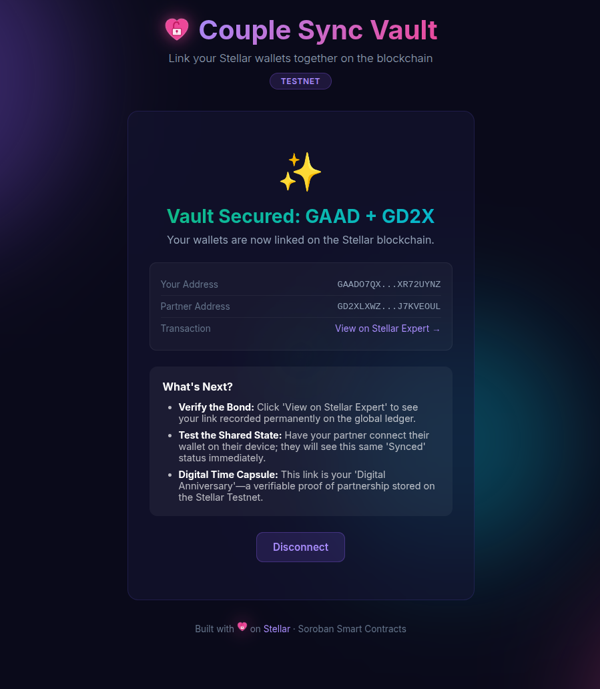

# Couple Sync

> Link your Stellar wallets together on the blockchain.  
> A **Soroban** smart contract dApp for the Stellar Yellow Belt — Level 2.



---

## Features

- **Multi-Wallet Support** — Uses `StellarWalletsKit` to offer Freighter, xBull, and Albedo wallet connections
- **Smart Contract** — Soroban `link_partners` contract stores partner pairs on-chain with Instance Storage
- **Real-Time Events** — Contract emits `SyncSuccessful` events that the frontend polls for live updates
- **Error Handling** — Three professional error states: Wallet Not Found, User Rejected, Insufficient Funds
- **Premium UI** — Dark theme with glassmorphism, animated gradient orbs, and micro-animations

### 📡 Real-Time State Sync
To satisfy the Level 2 requirement for real-time data synchronization:
- The dApp uses a `useEffect` hook to subscribe to contract events via the Stellar SDK.
- When the `SyncSuccessful` event is emitted by the Soroban contract, the frontend triggers a "Heartbeat" pulse animation on the logo without a page refresh.
---

## Wallet Options

The "Select Wallet" modal provides users with a choice of Stellar wallets:

| Wallet      | Description              |
|-------------|--------------------------|
| 🚀 Freighter | Browser extension wallet |
| 🐂 xBull     | Multi-platform wallet    |
| 🌟 Albedo    | Web-based wallet         |

---

## Contract ID

```text
CBTWI3DMBN4P3XVEUPKSVOSRYH6NFKYZ3RFKWA54YGBTEOA4YSO7VLOW
```

> Replace with your deployed Contract ID after running the deploy command.

---

## Setup Instructions

### Prerequisites

- [Rust](https://www.rust-lang.org/) (1.80+)
- [Node.js](https://nodejs.org/) (18+)
- [Stellar CLI](https://developers.stellar.org/docs/tools/developer-tools/cli/install-cli) (25+)
- `wasm32-unknown-unknown` and `wasm32v1-none` Rust targets

### 1. Clone & Install

```bash
git clone <YOUR_REPO_URL>
cd couple-sync
npm install --prefix frontend
```

### 2. Build & Test the Contract

```bash
cargo test                 # Run unit tests (4 tests)
stellar contract build     # Build WASM
```

### 3. Deploy to Testnet

```bash
stellar keys generate alice --network testnet --fund
stellar contract deploy \
  --wasm target/wasm32-unknown-unknown/release/couple_sync.wasm \
  --source alice \
  --network testnet
```

Save the returned Contract ID and update `CONTRACT_ID` in `frontend/src/components/CoupleSync.tsx`.

### 4. Run the Frontend

```bash
cd frontend
npm run dev
```

Open [http://localhost:4321](http://localhost:4321) in your browser.

---

## Tech Stack

| Layer           | Technology                        |
|-----------------|-----------------------------------|
| Smart Contract  | Rust + Soroban SDK 25             |
| Frontend        | Astro 5 + React 19               |
| Wallets         | @creit.tech/stellar-wallets-kit   |
| Blockchain      | Stellar SDK                       |
| Network         | Stellar Testnet                   |

---

## Transaction Hash

```text
49329072fbe1ab7dde5d49888de58e168fdb75c453ffa3a90560e4044d4bcb44
```

> [View on Stellar Expert](https://stellar.expert/explorer/testnet/tx/49329072fbe1ab7dde5d49888de58e168fdb75c453ffa3a90560e4044d4bcb44)

---

## Vercel Link

```text
https://yellow-belt-payment-tracker.vercel.app/
```

---

## License

MIT
